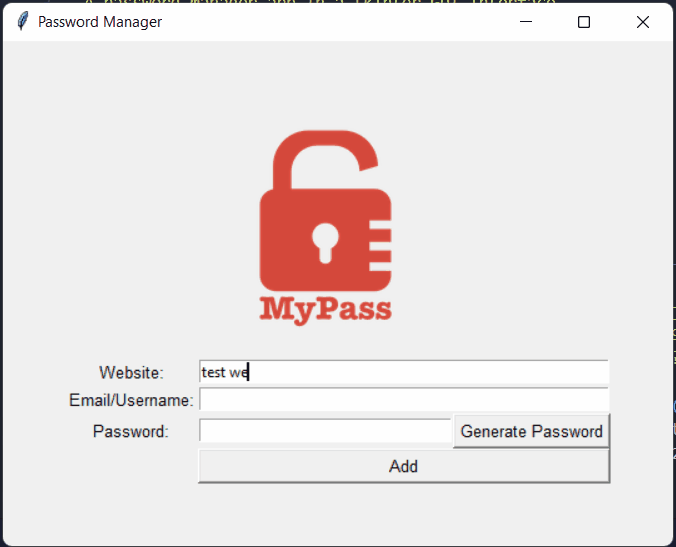
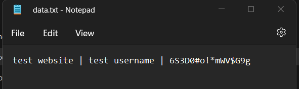

# password-manager

## 📝 Description
A password manager app for generating strong passwords and storing login information locally.  

## App Screenshots

*gif showing how the app works*
  

*image showing the stored info in a txt file*

## ✔️ Features
- Form fields for:
    - website name
    - email/username
    - password
- Popup verification window before saving user entries.
- Form fields verification, will not allow empty entry fields in the form.  

## 🆘 Known Issues
- storing user info in txt file is inefficient for later processing.
- User info is unencrypted at rest, hence not very secure.
  

## 🕑 In the works
- Add a search functionality, i.e allow users to search for previously saved information.
- Check for duplication upon save and warn user if exists.
- Encrypt user information when stored in database

